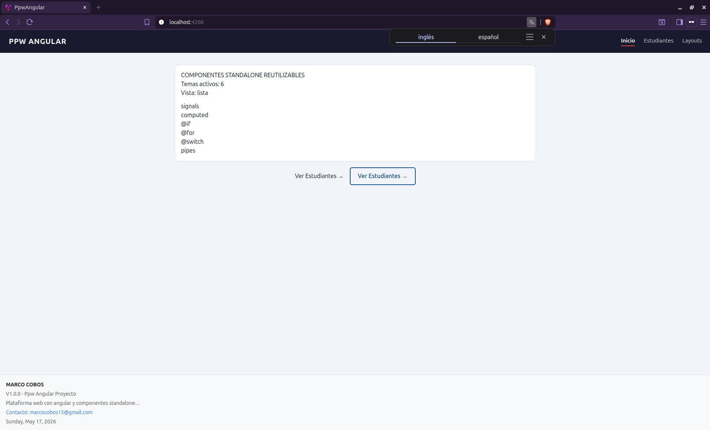
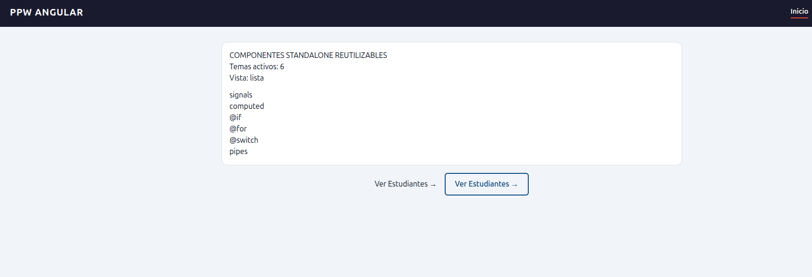
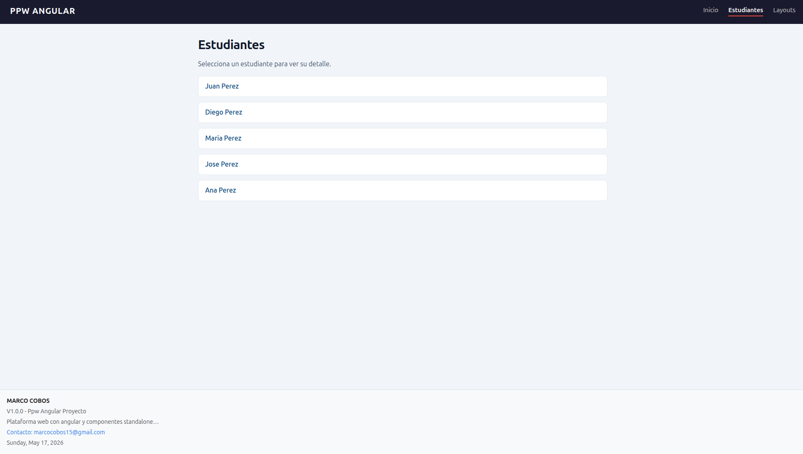

# PPW Angular — Práctica 04: Layouts con Tailwind CSS

Proyecto Angular que migra estilos CSS personalizados a utilidades de Tailwind CSS e implementa una página de demostración de distribuciones de layout.

---

## Contenido

- [Shell principal](#shell-principal)
- [HomePage](#homepage)
- [StudentsPage](#studentspage)
- [StudentDetailPage](#studentdetailpage)
- [LayoutsPage](#layoutspage)
  - [Grid de 4 columnas](#grid-de-4-columnas)
  - [Grid con sidebar](#grid-con-sidebar)
  - [Grid de 3 columnas](#grid-de-3-columnas)
  - [Flex: carrusel horizontal](#flex-carrusel-horizontal)
  - [Flex: wrap con alineación](#flex-wrap-con-alineación)
  - [Extra 1 — Grid auto-fill responsive](#extra-1--grid-auto-fill-responsive)
  - [Extra 2 — Grid con áreas nombradas](#extra-2--grid-con-áreas-nombradas)
  - [Extra 3 — Flex justify-between](#extra-3--flex-justify-between)
  - [Extra 4 — Grid 2 col con card destacado](#extra-4--grid-2-col-con-card-destacado)

---

## Shell principal

**Archivo:** `src/app/app.html`

Implementa el patrón **sticky footer**: el contenedor raíz ocupa como mínimo toda la altura de la pantalla (`min-h-screen`) y organiza header, contenido y footer en columna (`flex-col`). El `<main>` crece con `flex-1` para empujar el footer hacia abajo incluso cuando el contenido de la página es escaso. `max-w-5xl` limita el ancho del contenido a ~1024px para mantener líneas legibles en monitores grandes.

| Clase Tailwind | Efecto |
|---|---|
| `flex min-h-screen flex-col` | Sticky footer pattern |
| `bg-slate-100` | Fondo neutro de toda la app |
| `flex-1 mx-auto w-full max-w-5xl` | Contenido centrado con ancho máximo |
| `px-6 py-8` | Espaciado interior uniforme en todas las páginas |



---

## HomePage

**Archivo:** `src/app/features/home/pages/home-page/home-page.html`

Muestra el componente hero y dos botones "Ver Estudiantes" con el mismo comportamiento pero estilos distintos, para comparar el enfoque de **clase CSS global** (`btn-primary` en `styles.css`) frente al enfoque **utility-first** de Tailwind (todo el estilo en el propio HTML).

El segundo botón aplica el patrón **fill on hover**: en reposo muestra solo borde y texto en color de marca; al pasar el cursor el fondo se rellena y el texto cambia a blanco gracias a `hover:bg-brand hover:text-white`.

| Clase Tailwind | Efecto |
|---|---|
| `space-y-8` | Ritmo vertical entre hero y acciones |
| `flex justify-center gap-4` | Botones centrados con separación |
| `border-2 border-brand text-brand` | Estilo outline con token de marca |
| `transition-colors duration-200` | Animación suave solo en propiedades de color |
| `hover:bg-brand hover:text-white` | Fill effect al pasar el cursor |



---

## StudentsPage

**Archivo:** `src/app/features/students/pages/students-page/students-page.html`

Lista de estudiantes en formato **card**. Cada ítem es un `<a>` con `display: block` para que toda el área sea zona de clic. El efecto hover (`hover:bg-slate-50 hover:border-brand`) indica interactividad sin JavaScript. Las clases BEM originales (`.students-list__item`, `.students-empty`, etc.) fueron eliminadas.

| Clase Tailwind | Efecto |
|---|---|
| `space-y-4` | Ritmo vertical entre título, subtítulo y lista |
| `flex flex-col gap-3 list-none p-0` | Lista sin bullets ni márgenes por defecto |
| `block px-4 py-3 bg-white rounded-lg` | Card con área de clic completa |
| `border border-slate-200` | Borde sutil que enmarca cada card |
| `hover:bg-slate-50 hover:border-brand` | Retroalimentación visual en hover |
| `italic text-slate-500` | Estado vacío diferenciado visualmente |



---

## StudentDetailPage

**Archivo:** `src/app/features/students/pages/student-detail-page/student-detail-page.html`

Muestra el ID del estudiante recibido por la URL en una caja con **acento visual izquierdo** (`border-l-4 border-l-brand`), un patrón de UI para destacar información contextual. El botón de retorno usa `<a>` con `routerLink` (semánticamente correcto para una navegación) y el mismo patrón fill on hover que el botón de la HomePage.

| Clase Tailwind | Efecto |
|---|---|
| `flex flex-col gap-5` | Distribución vertical con separación uniforme |
| `border-l-4 border-l-brand` | Acento visual izquierdo en color de marca |
| `bg-white border border-slate-200 rounded-lg` | Caja neutra que destaca sobre el fondo |
| `inline-block w-fit` | El enlace solo ocupa el ancho de su contenido |
| `hover:bg-brand hover:text-white` | Fill effect en el botón de retorno |


---

## LayoutsPage

**Archivo:** `src/app/features/layouts/pages/layouts-page/layouts-page.html`

Página de demostración que reúne ocho distribuciones de layout diferentes, cada una en un contenedor `<article>` con fondo blanco y borde sutil. Las secciones varían intencionalmente entre gradiente, sombra y combinación de ambos para ilustrar los efectos visuales disponibles.

---

### Grid de 4 columnas

Layout responsivo escalonado: **1 columna en móvil → 2 en sm (≥640px) → 4 en lg (≥1024px)**. Es el patrón más habitual en dashboards de métricas (KPI cards). Los gradientes diagonales (`bg-linear-to-br`) aportan profundidad sin imágenes. `shadow-lg` refuerza la elevación visual de cada card.

| Clase Tailwind | Efecto |
|---|---|
| `grid gap-4` | CSS Grid con separación de 1rem |
| `sm:grid-cols-2` | 2 columnas en pantallas ≥ 640px |
| `lg:grid-cols-4` | 4 columnas en pantallas ≥ 1024px |
| `bg-linear-to-br from-sky-400 to-blue-600` | Gradiente diagonal azul |
| `shadow-lg` | Sombra grande que eleva el card |
| `opacity-80 / opacity-90` | Jerarquía visual sin cambiar el color |

**Escritorio (4 columnas):**


**Móvil (1 columna):**


---

### Grid con sidebar

Layout de **panel administrativo**: columna fija de 240px para el sidebar + área principal flexible que ocupa el espacio restante. En móvil ambas columnas se apilan. Usa solo sombra (sin gradiente) para demostrar que la jerarquía visual no requiere color adicional.

| Clase Tailwind | Efecto |
|---|---|
| `lg:grid-cols-[240px_minmax(0,1fr)]` | Valor arbitrario: sidebar fijo + contenido flexible |
| `shadow-md` | Sombra mediana sin gradiente |
| `bg-slate-50` | Fondo levemente diferenciado del blanco puro |

> `minmax(0, 1fr)` en lugar de `1fr` previene desbordamiento cuando el contenido tiene texto largo sin espacios.


---

### Grid de 3 columnas

Distribución **simétrica en 3 columnas** activa a partir de 768px. Usa gradiente con dirección `to-tr` (abajo-izquierda → arriba-derecha) para variar visualmente respecto a las secciones anteriores. La ausencia de sombra demuestra que el gradiente por sí solo aporta suficiente profundidad.

| Clase Tailwind | Efecto |
|---|---|
| `md:grid-cols-3` | 3 columnas en pantallas ≥ 768px |
| `gap-6` | Separación de 1.5rem entre celdas |
| `bg-linear-to-tr` | Gradiente de abajo-izquierda a arriba-derecha |


---

### Flex: carrusel horizontal

Lista horizontal con **scroll lateral controlado**. `overflow-x-auto` habilita el desplazamiento solo cuando el contenido supera el ancho del contenedor. `min-w-[16rem]` + `shrink-0` en cada card garantizan que las tarjetas no se compriman independientemente del viewport.

| Clase Tailwind | Efecto |
|---|---|
| `flex gap-4 overflow-x-auto pb-2` | Fila con scroll horizontal y espacio para la scrollbar |
| `min-w-[16rem]` | Ancho mínimo fijo de 256px por card |
| `shrink-0` | Impide que el card se comprima dentro del flex |

**Escritorio:**


**Móvil (scroll activo):**


---

### Flex: wrap con alineación

Los cards **saltan de fila automáticamente** cuando no caben en el ancho disponible. `w-56` (224px) en cada card determina implícitamente cuántos caben por fila. `items-start` evita que cards de alturas distintas se estiren. `ring-1` es una alternativa a `border` que no afecta el box model.

| Clase Tailwind | Efecto |
|---|---|
| `flex flex-wrap gap-4` | Flexbox con salto de fila automático |
| `items-start` | Alineación al inicio del eje cruzado (altura natural) |
| `w-56` | Ancho fijo de 224px que controla los cards por fila |
| `shadow-xl` | Sombra extra prominente |
| `ring-1 ring-slate-200` | Borde alternativo que no altera el box model |


---

### Extra 1 — Grid auto-fill responsive

Grid **completamente responsivo sin breakpoints manuales**. `repeat(auto-fill, minmax(200px, 1fr))` delega al navegador el cálculo de cuántas columnas caben: cada columna tiene un mínimo de 200px y crece proporcionalmente hasta llenar la fila. Funciona dentro de cualquier contenedor sin importar su ancho.

| Clase Tailwind | Efecto |
|---|---|
| `grid-cols-[repeat(auto-fill,minmax(200px,1fr))]` | Columnas automáticas con mínimo 200px |
| `gap-4` | Separación de 1rem entre celdas |

**Escritorio:**


**Móvil (2 columnas automáticas):**


---

### Extra 2 — Grid con áreas nombradas

Define una **plantilla de página completa** usando `grid-template-areas`. Cada zona (header, sidebar, main, footer) se nombra en la plantilla y se asigna con `[grid-area:nombre]`, desacoplando el orden en el HTML del orden visual. En móvil todas las zonas se apilan; en `lg` se activa la distribución de 2 columnas.

| Clase Tailwind | Efecto |
|---|---|
| `[grid-template-areas:'...']` | Valor arbitrario con plantilla de áreas |
| `lg:grid-cols-[200px_1fr]` | 2 columnas activas en pantallas ≥ 1024px |
| `[grid-area:header]` | Asigna el elemento a la zona header |

**Escritorio (sidebar + main en fila):**


**Móvil (zonas apiladas):**


---

### Extra 3 — Flex justify-between

Simula una **barra de navegación**: `justify-between` empuja el logotipo al inicio del eje principal y las acciones al final. Es el patrón estándar para navbars y toolbars. `bg-white/10` crea botones fantasma sobre el fondo oscuro sin un token de color adicional.

| Clase Tailwind | Efecto |
|---|---|
| `flex items-center justify-between` | Distribución navbar: inicio ↔ fin |
| `bg-white/10` | Blanco al 10% de opacidad para botones fantasma |
| `bg-brand` | Token de marca para el enlace activo |


---

### Extra 4 — Grid 2 col con card destacado

Grid de 2 columnas donde el primer card usa `col-span-2` para **ocupar ambas columnas**, creando jerarquía visual que comunica que es el elemento más importante de la sección. Los cards secundarios de 1 columna conviven en la fila siguiente sin necesidad de anidar grids.

| Clase Tailwind | Efecto |
|---|---|
| `grid grid-cols-2 gap-4` | Grid de 2 columnas con separación de 1rem |
| `col-span-2` | El card ocupa ambas columnas del grid |
| `bg-linear-to-r from-brand to-sky-500` | Gradiente horizontal con color de marca |


---

## Comandos de desarrollo

```bash
# Iniciar el servidor de desarrollo
ng serve

# Compilar para producción
ng build

# Ejecutar tests unitarios
ng test
```
