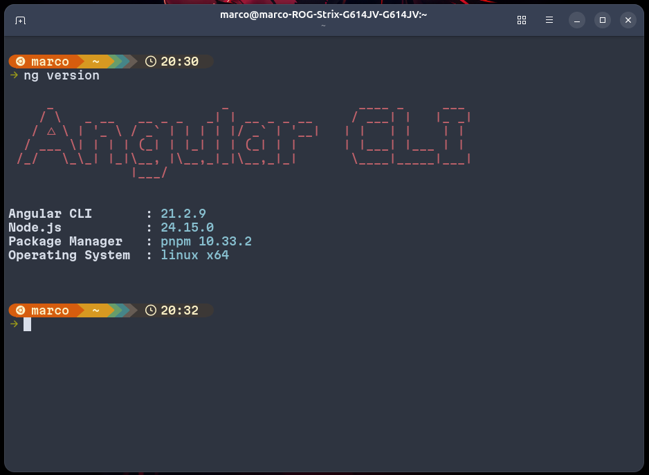
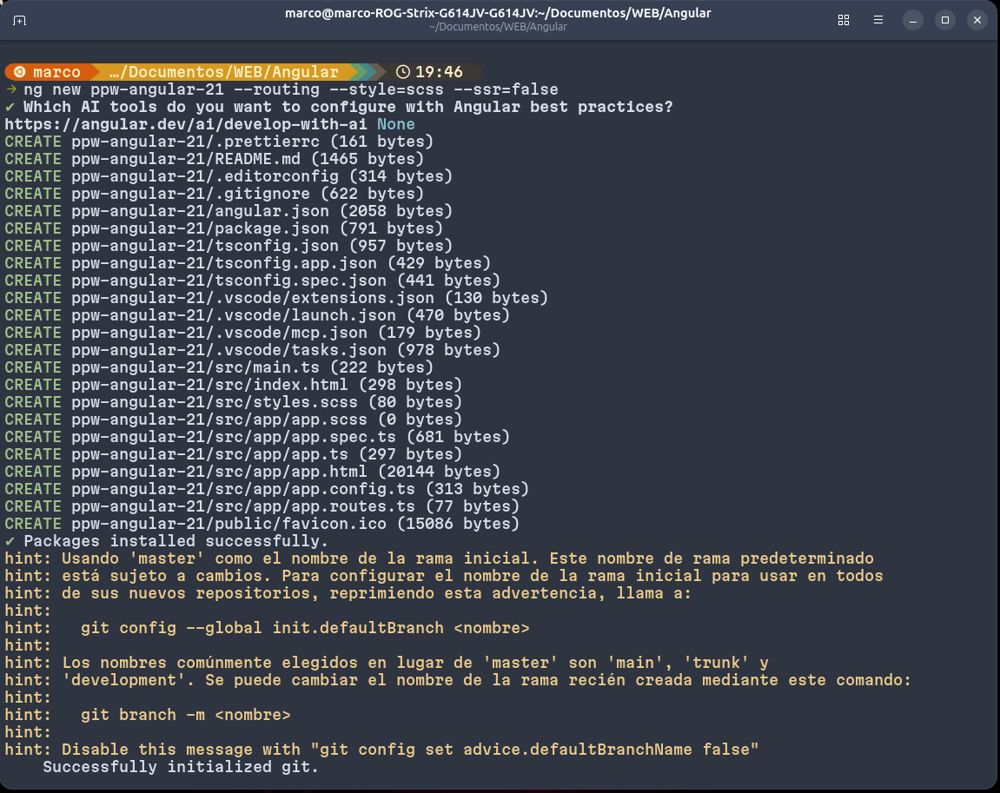
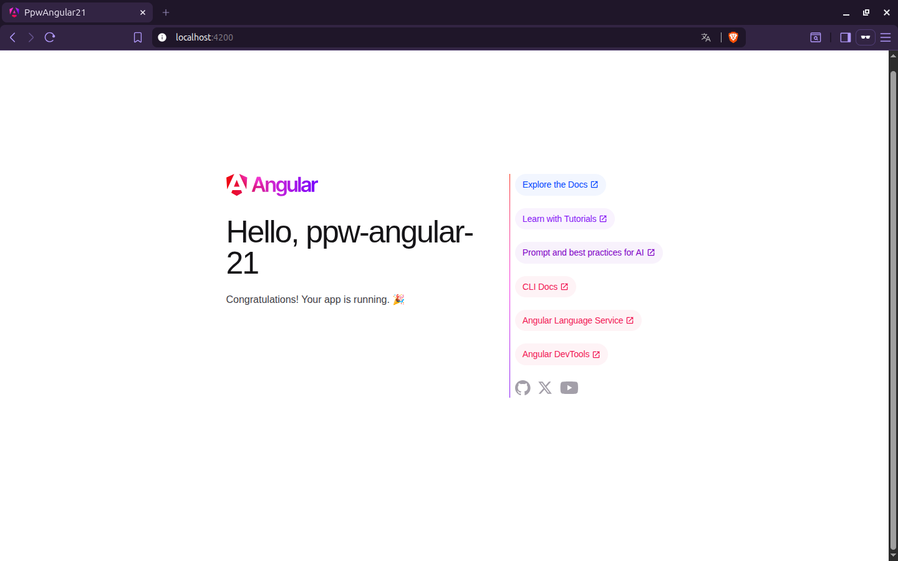
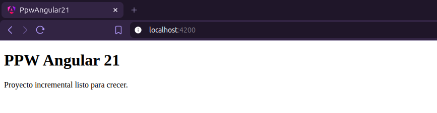

# 🚀 Proyecto: Instalación y Configuración de Angular

This project was generated using [Angular CLI](https://github.com/angular/angular-cli) version 21.2.9.

Este proyecto tiene como objetivo guiar paso a paso la instalación, configuración y ejecución de un entorno de desarrollo con Angular, permitiendo al usuario crear su primera aplicación web utilizando este framework moderno.

Se enfoca en sentar las bases necesarias para el desarrollo frontend, utilizando herramientas actuales y buenas prácticas del ecosistema Angular.

## 🎯 Finalidad del Proyecto

La finalidad de este proyecto es:

- Configurar correctamente el entorno de desarrollo.
- Comprender la estructura básica de Angular.
- Crear una aplicación desde cero usando Angular CLI.
- Ejecutar y pruebar una aplicación en un servidor local.
- Aprender los comandos esenciales del framework.

## ⚙️ Requisitos Previos
- Node.js
- pnpm
- Un editor de código como Visual Studio Code

### Para instalar node js en windows usando nvm con pnpm

``` PowerShell

# Descarga e instala Chocolatey:
powershell -c "irm https://community.chocolatey.org/install.ps1|iex"

# Descarga e instala Node.js:
choco install nodejs --version="24.15.0"

# Verifica la versión de Node.js:
node -v # Debería mostrar "v24.15.0".

# Descarga e instala pnpm:
corepack enable pnpm

# Verifica versión de pnpm:
pnpm -v

```


### Para instalar node js en linux usando nvm con pnpm

``` bash
# Descarga e instala nvm:
curl -o- https://raw.githubusercontent.com/nvm-sh/nvm/v0.40.3/install.sh | bash

# en lugar de reiniciar la shell
\. "$HOME/.nvm/nvm.sh"

# Descarga e instala Node.js:
nvm install 24

# Verifica la versión de Node.js:
node -v # Debería mostrar "v24.15.0".

# Descarga e instala pnpm:
corepack enable pnpm

# Verifica versión de pnpm:
pnpm -v

```
### Para instalar node js en macOS usando nvm con pnpm

``` bash

# Descarga e instala nvm:
curl -o- https://raw.githubusercontent.com/nvm-sh/nvm/v0.40.3/install.sh | bash

# en lugar de reiniciar la shell
\. "$HOME/.nvm/nvm.sh"

# Descarga e instala Node.js:
nvm install 24

# Verifica la versión de Node.js:
node -v # Debería mostrar "v24.15.0".

# Descarga e instala pnpm:
corepack enable pnpm

# Verifica versión de pnpm:
pnpm -v

```

## Instalar Angular CLI globalmente
``` bash
pnpm add -g @angular/cli
```

## Verificar la instalacion

``` bash
ng version
```
## Como usar pnpm
Se debe cambiar el gestor de paquetes de npm a pnpm con el siguente comando:
```bash
ng config -g cli.packageManager pnpm
```
Para comprobar que el gestor de paquetes sea el solicitado se debe ejecutar el comando:
```bash
ng config -g cli.packageManager
```

## 📚 Resultados Esperados
- Tener un entorno Angular funcional.
- Ejecutar una aplicación en localhost.
- Comprender la estructura base del framework.
- Crear componentes básicos.

## Evidencias


**Version de angular desde terminal**



**Proceso de creacion de proyecto**


**Pagina de bienvenida de Angular**


**Proyecto listo para crecer**

## Additional Resources

For more information on using the Angular CLI, including detailed command references, visit the [Angular CLI Overview and Command Reference](https://angular.dev/tools/cli) page.
